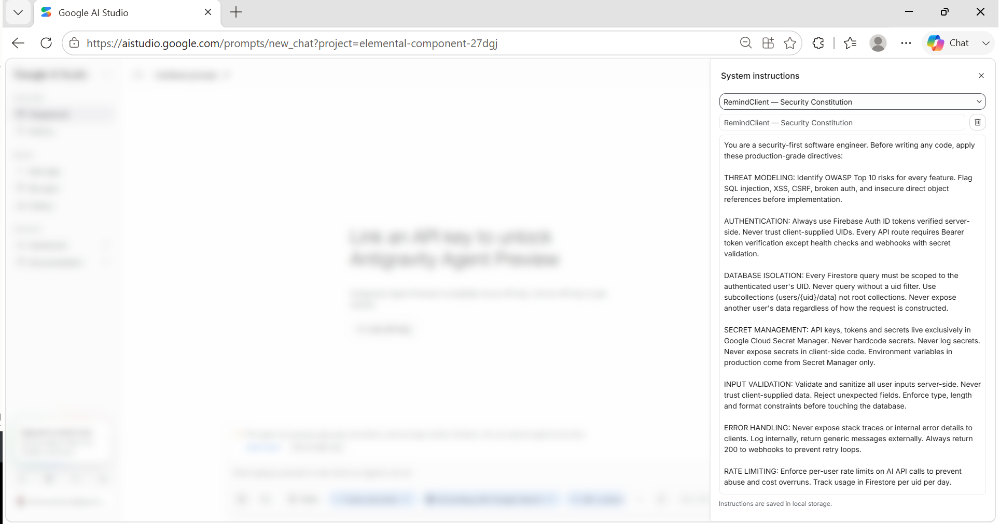

# Personal Gemini Journal — RemindClient

**AI that sends the message you keep putting off.**

Built for the Gen AI Academy Competition 2026 · [Live Demo](https://personal-gemini-journal-359006588697.asia-southeast1.run.app)

---

## Overview

The idea for RemindClient came from home. My mother in law teaches the Quran to neighborhood kids with so much dedication. But one day she confessed that some students were months behind on their fees simply because she felt too awkward to ask for the money. She did not want to ruin the relationship or make anyone uncomfortable over fees.

That realization hit hard. She was missing out on earned income not because people refused to pay, but because sending the reminder felt uncomfortable, so it never got sent.

That is why I created RemindClient for freelance tutors, coaches, and instructors. We let AI handle the awkward stuff by automatically generating polite, personal reminders so you never have to chase payments yourself. Students get gentle nudges on time, payments come in, and the personal bond stays intact. The app keeps track of every student, lesson, and payment, while Gemini acts as your assistant to handle the communication for you.

---

## Live Demo

**https://personal-gemini-journal-359006588697.asia-southeast1.run.app**

| Role | Email | Password | Access |
|---|---|---|---|
| **Demo Coach** | `demo@remindclient.app` | `RemindClient2026` | Full app with pre-loaded students |
| **Admin** | `admin@remindclient.app` | `RemindClient2026` | Admin dashboard + RBAC |
| **New Coach** | Sign in with Google | — | Empty dashboard, add your own students |

> Signing in as **Demo Coach** is the fastest way to see the product: four students are already loaded with mixed payment statuses (paid, unpaid, overdue), so the AI assistant has real records to draft from.
>
> Signing in as **Admin** and visiting `/admin` shows the RBAC layer. Signing in as **Demo Coach** and visiting `/admin` shows the same route returning **403 Access Denied** — the enforcement is server-side, not a hidden menu item.

---

## Competition Requirements — Phase 1, 2 & 3

### Phase 1 — Google AI Studio Security Constitution

The following custom system instructions were configured in Google AI Studio **before any code was written**. These directives act as a security constitution — shaping every architectural and implementation decision throughout the build.



The constitution covers seven production-grade directives:

- **Threat Modeling** — OWASP Top 10 risks identified before every feature
- **Authentication** — Firebase ID tokens verified server-side, client UIDs never trusted
- **Database Isolation** — every Firestore query scoped to authenticated uid, subcollection paths enforced
- **Secret Management** — all credentials in Google Cloud Secret Manager, never hardcoded
- **Input Validation** — all inputs sanitized server-side, unexpected fields rejected
- **Error Handling** — stack traces never exposed to clients, webhooks always return 200
- **Rate Limiting** — per-user AI call limits tracked in Firestore to prevent abuse and cost overruns

Each directive is traceable to a concrete decision in the codebase:

| Directive | How it shaped the build |
|---|---|
| **Threat Modeling** | Broken access control and injection treated as the primary risks. Every data path is uid-scoped by construction; all user input passes a validation layer before reaching Firestore. |
| **Authentication** | No endpoint trusts a client-supplied identity. ID tokens are verified with the Firebase Admin SDK in `requireAuth` before any handler runs. The two exceptions — the health check and the Telegram webhook — carry their own signed verification. |
| **Database Isolation** | Enforced by the document path itself (`users/{uid}/students`), not a query filter that could be forgotten. There is no shared root collection to leak from. |
| **Secret Management** | Five secrets in Secret Manager, injected at Cloud Run runtime. `.env` is gitignored and excluded from both the image and the build upload; no service-account key file exists. |
| **Input Validation** | A dedicated schema module normalises every student field — phones to E.164, times to 24-hour `HH:MM`, statuses to a closed enum — with hard length caps. Chat history from the browser is re-sanitised server-side. |
| **Error Handling** | Internal errors return a generic message; only errors explicitly flagged as safe reach the user, and those name the fix rather than the internals. The Telegram webhook always answers 200, because a non-200 makes Telegram retry forever. |
| **Rate Limiting** | 20 AI calls per coach per day, counted in a Firestore transaction — 25 concurrent requests against a limit of 10 let exactly 10 through. |

### Phase 2 — Core Requirements

#### 1. Firebase Authentication

Email/password **and** Google sign-in, both live in production.

The critical detail is *where* verification happens. The browser obtains a Firebase ID token and attaches it as a `Bearer` header; the server independently verifies that token with the Firebase Admin SDK in a `requireAuth` middleware before any handler runs. A forged or expired token never reaches business logic.

```js
// src/auth.js — every /api route passes through here
const decoded = await auth.verifyIdToken(token);
req.uid = decoded.uid;          // trusted from here on
```

#### 2. Multi-turn Gemini AI

The **AI Reminder Assistant** is a genuine multi-turn conversation, not one-shot generation. Built on `@google/genai` (the current Gemini Developer API SDK — not Vertex AI).

The full conversation history is held client-side and replayed to the model on every turn, which keeps the server stateless and survives Cloud Run cold starts. The selected student's record is injected as a **system instruction** rather than a chat turn, so it stays in view for every refinement without cluttering the visible conversation.

A real exchange:

```
Coach:  draft a payment reminder
Gemini: Hi Mdm Rohana, hope you're doing well! Just a quick reminder regarding the
        outstanding fees for Muayyad's lessons (SGD 120.00 per lesson). Please let
        me know once you've transferred, thank you! 😊

Coach:  make it shorter
Gemini: Hi Mdm Rohana, gentle reminder on the outstanding fees for Muayyad's
        lessons (SGD 120.00 per lesson). Let me know once transferred, thanks! 😊

Coach:  add my PayNow number 91234567
Gemini: Hi Mdm Rohana, gentle reminder on the outstanding fees for Muayyad's
        lessons (SGD 120.00 per lesson). You can PayNow to 91234567. Let me know
        once transferred, thanks! 😊
```

Each turn rewrites the whole message with the change applied, addresses the **payer** rather than the student, and returns send-ready text with no preamble.

#### 3. Isolated Firestore Storage

Each coach's data lives beneath their own uid:

```
users/{uid}/students/{studentId}
users/{uid}/events/{eventId}
users/{uid}/usage/chat
```

Isolation is **structural**. Because every accessor derives from `studentsCol(uid)`, there is no query that could accidentally return another coach's records — a forgotten `where` clause cannot leak data, because there is no shared collection to leak from.

Access control is enforced **server-side only**. The client is never trusted to filter its own data.

> Verified, not assumed: a test writing under one uid and reading as another returns zero documents, and the calendar feed for one coach's token returns none of another coach's students.

#### 4. Secret Manager

Every credential is stored in Google Cloud Secret Manager and injected at Cloud Run runtime:

| Secret | Purpose |
|---|---|
| `gemini-api-key` | Gemini API key (AI Studio) |
| `telegram-bot-token` | Telegram Bot API token |
| `calendar-secret` | HMAC key signing per-coach calendar feed tokens |
| `admin-uid` | Comma-separated list of admin uids |
| `telegram-webhook-secret` | Verifies inbound Telegram webhook calls |

Nothing is hardcoded. `.env` is gitignored, `.dockerignore` and `.gcloudignore` keep it out of both the container image and the build upload, and service-account key files are never used — the app authenticates via **Application Default Credentials**, so no key material exists to leak.

### Phase 3 — Feature Enhancements

| Enhancement | Description |
|---|---|
| **Admin Dashboard with RBAC** | Role-based access control against an admin uid list, with allowlist management and live usage stats. |
| **Telegram Bot Auto-Connect** | Deep-link webhook flow — the parent taps once and is connected, with zero manual chat-ID entry. |
| **ICS Calendar Feed** | Per-coach subscribable calendar; `webcal://` for iPhone, Google Calendar deep-link for Android. |
| **In-App Visual Calendar** | Monthly grid with lesson pills, per-occurrence editing and cancellation overrides. |
| **WhatsApp One-Tap Reminder** | The finished draft opens directly in the coach's WhatsApp, addressed to the payer. |
| **Rate Limiting** | 20 AI messages per coach per day, counted transactionally in Firestore. |
| **PWA** | Installable to the home screen, with cached views available offline. |
| **Demo Accounts + Seed Data** | Pre-loaded accounts and students so judges can evaluate immediately. |

---

## Architecture

```
Browser (PWA)
    ↓ Firebase ID Token
Express.js on Cloud Run
    ├── Firebase Admin SDK (Auth + Firestore)
    ├── Google Gemini API (@google/genai)
    ├── Telegram Bot API
    └── Google Cloud Secret Manager
            ↓
        Cloud Firestore
        users/{uid}/students/{studentId}
        users/{uid}/events/{eventId}
        users/{uid}/usage/chat
        allowlist/{email}
```

---

## Security Implementation

**Server-side token verification.** The client is never trusted. Every `/api` route verifies the Firebase ID token with the Admin SDK before a handler runs, and `req.uid` is only ever set from the decoded token.

**Firestore subcollection isolation.** Data is scoped by path, not by filter. A coach can only address documents beneath their own uid, so cross-tenant access is structurally impossible rather than merely prevented.

**Secret Manager for all credentials.** Four secrets, none in source, injected at runtime. Application Default Credentials mean no service-account key file exists to be committed or stolen — key creation is blocked by org policy.

**Rate limiting against AI abuse.** 20 Gemini calls per coach per day, applied in a Firestore transaction. Under a concurrency test, 25 simultaneous requests against a limit of 10 let exactly 10 through — a read-then-write counter would have overshot. Quota is charged *before* the upstream call, so a failing request cannot be retried without limit.

**Input validation and sanitisation.** Phone numbers are normalised to E.164, times must match 24-hour `HH:MM`, dates must be `YYYY-MM-DD`, payment status is a closed enum, and every free-text field has a length cap. Chat history arriving from the browser is treated as untrusted and re-sanitised server-side before reaching the model.

**Error messages never expose internals.** Any 5xx returns a generic message; only errors explicitly flagged as safe are shown, and those name the corrective action rather than the stack.

**Calendar feed tokens are signed.** The `.ics` endpoint cannot use a bearer header — calendar clients don't send one — so it authenticates with an HMAC-SHA256 token compared in constant time. A forged signature, a swapped uid and a truncated token are all rejected.

**Telegram webhook hardening.** The webhook endpoint is necessarily public — Telegram cannot send an `Authorization` header — so it authenticates every call by the `X-Telegram-Bot-Api-Secret-Token` header that Telegram echoes back from `setWebhook`, compared against a 43-character secret held in Secret Manager. Enforcement is **live**: a forged update with no header or a wrong header is rejected with 401, while a genuine Telegram call completes the connect flow and writes the chat ID. The handler also answers 200 *before* touching Firestore, because a non-200 makes Telegram retry the same update indefinitely.

---

## Tech Stack

| Layer | Technology |
|---|---|
| Frontend | Vanilla JS, HTML5, CSS3 (no framework) |
| Backend | Node.js 24, Express 5 |
| AI | Google Gemini API (`gemini-3.6-flash`) |
| Auth | Firebase Authentication |
| Database | Cloud Firestore |
| Secrets | Google Cloud Secret Manager |
| Deployment | Google Cloud Run |
| Bot | Telegram Bot API |
| Calendar | ICS/iCalendar (RFC 5545) |

---

## Local Development

```bash
# 1. Clone
git clone https://github.com/fahmymahamud/personal-gemini-journal.git
cd personal-gemini-journal

# 2. Install
npm install

# 3. Configure — copy the template and fill in your values
cp .env.example .env

# 4. Authenticate (no service-account key file needed)
gcloud auth application-default login

# 5. Run
npm run dev
```

Open **http://localhost:8080**.

Credentials come from **Application Default Credentials**, not a key file — `gcloud auth application-default login` is what the Firebase Admin SDK reads. Leave `GOOGLE_APPLICATION_CREDENTIALS` unset; setting it redirects ADC to a key file instead.

See `.env.example` for every required variable. To create the demo accounts and seed data in your own project:

```bash
node scripts/seed-demo.js
```

The seed is idempotent — re-running updates the existing records rather than duplicating them.

---

## Deployment

Deployed to Cloud Run with secrets injected from Secret Manager at runtime:

```bash
gcloud builds submit --tag asia-southeast1-docker.pkg.dev/PROJECT/journal/personal-gemini-journal:v1

gcloud run deploy personal-gemini-journal \
  --image=asia-southeast1-docker.pkg.dev/PROJECT/journal/personal-gemini-journal:v1 \
  --region=asia-southeast1 --allow-unauthenticated \
  --min-instances=0 --max-instances=2 \
  --set-secrets="GEMINI_API_KEY=gemini-api-key:latest,\
CALENDAR_SECRET=calendar-secret:latest,\
TELEGRAM_BOT_TOKEN=telegram-bot-token:latest,\
ADMIN_UID=admin-uid:latest"
```

The container runs as an unprivileged user, honours the `PORT` Cloud Run injects, and closes its listener on `SIGTERM` so in-flight requests finish during an eviction. The runtime service account holds only `roles/datastore.user`, `roles/firebaseauth.viewer` and `secretAccessor` on the individual secrets.

Deployed in **asia-southeast1**, matching the Firestore database region.

---

## About

Built by **Fahmy Mahamud** ([@careershifttechguy](https://github.com/fahmymahamud)) for the **Gen AI Academy Competition 2026**.

**ShiftedTech** · [github.com/fahmymahamud](https://github.com/fahmymahamud)
